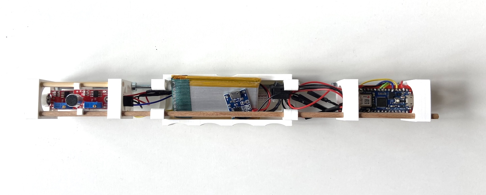

# STL Models for Stab Interaction (Arduino + Sensor Setup)

This repository contains STL models designed for a stab interaction project using Arduino and sensors.

### Project
[https://github.com/jeonghopark/stab_interaction_modechange](https://github.com/jeonghopark/stab_interaction_modechange)

### Arduino
[https://github.com/jeonghopark/stab_nano33_iot_twomic_a](https://github.com/jeonghopark/stab_nano33_iot_twomic_a)

## Contents
- 3D printable parts for mounting sensors
- Structural components for interactive physical interfaces

## Connector Info
All parts are designed to be connected using a **4mm wooden dowel** (or thin threaded rod).  
You can use standard **M4 Gewindestangen (threaded rods)** or 4mm wooden sticks as connectors.

## Compatibility
- Designed for use with **Arduino-compatible sensor modules**
- Suitable for physical computing or interaction design prototypes

## Notes
- The models are optimized for FDM printing (PLA recommended)
- You may need glue or screws for reinforcement depending on the application

---

Feel free to adapt or remix for your own sensor-based interaction systems.

